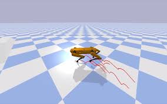

# Legged_Robot

This folder contains all the exercice from the course legged Robots (MICRO-507) from EPFL. It presents the design, control, and applications of legged robots. It gives a review of different types of legged robots (including two-, four- and multi-legged robots) and different control approaches for legged locomotion.

